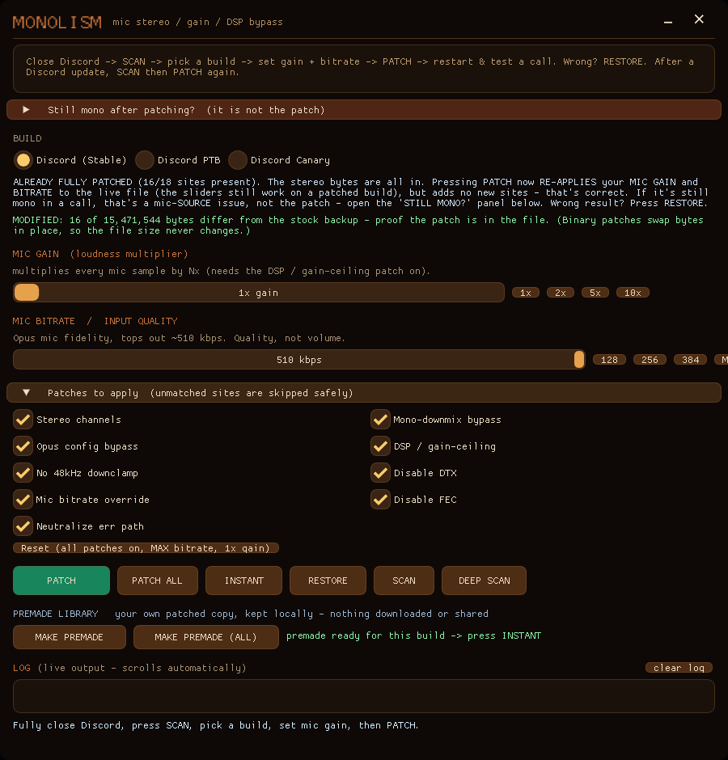

# 🎙️ MONOLISM

### Force **real stereo**, **uncapped gain**, and a **filter-free mic** out of Discord — 100% local.
**Nothing downloaded. Nothing phoned home. Your file never leaves your PC.**

Discord quietly wrecks your microphone before anyone hears it: it collapses you to **mono**, **gates** your quiet passages, **caps** your gain, and shoves your voice through noise-suppression / echo-cancel / AGC **DSP**. MONOLISM byte-patches Discord's own voice module (`discord_voice.node`) **on your machine** to undo all of that — every edit is verified before it's written, and it's reversible in one click.

> 🔌 No network · 🙈 No telemetry · 📦 No downloaded modules · ↩️ One-click restore

---

## ✨ What it does

- **Real stereo mic** — flips Discord's Opus encoder from 1 → 2 channels and neutralizes the sites that force a mono downmix.
- **Uncapped mic gain** — a continuous **1×–20×** loudness multiplier baked straight into the input DSP loop (not Discord's soft cap).
- **Configurable bitrate** — **96–510 kbps** Opus, your call, for a fuller, higher-fidelity mic.
- **Kills the mic DSP** — removes the hardcoded input high-pass / DC-reject / AGC gain-ceiling that a settings toggle can't turn off.
- **No silence gating / no FEC tax** — disables DTX and FEC so quiet detail survives (works on every build).
- **Premade library + INSTANT swap** — bake a fully-patched copy of *your own* module once, then re-apply it in a single click after any revert.
- **Honest by design** — it only writes bytes it has located *and verified*. Unmatched sites are skipped, never force-written. It never claims a patch it didn't make.

## ⚡ Quick start

1. **Fully close Discord** (MONOLISM force-closes it for you too).
2. Run the app → press **SCAN** and pick your build.
3. Set your **MIC GAIN** and **BITRATE**, tick the patches you want.
4. Press **PATCH** → restart Discord → **test a call**.
5. Wrong / weird? Press **RESTORE** — instant rollback from the automatic backup.

That's it. After a Discord update, just **SCAN → PATCH** again — it auto-finds the new module and re-backs-up.

## 🎧 "I patched it but it's still mono!" — read this first

The patch makes Discord **encode** stereo. It **cannot invent a second channel your input doesn't have.** To actually *hear* stereo, all three must be true:

1. **Feed a stereo source.** A microphone is mono — encoding a mono mic as "stereo" is dual-mono, which sounds identical to mono. Route a real stereo source (e.g. music) into Discord's **input** with a virtual cable (VB-Audio Virtual Cable / VoiceMeeter) and set **Input Device = CABLE Output**.
2. **Turn off Discord's mic processing.** Voice & Video → **off**: Echo Cancellation, Noise Suppression (incl. Krisp), Automatic Gain Control. These run *before* the encoder and re-collapse you to mono.
3. **Have a friend listen** to hard-panned L/R material. You can't hear your own stereo — Discord doesn't loop your mic back, and the mic-test is mono.

## 🧠 How it works (the short version)

`discord_voice.node` is the native module Discord uses to process and encode your mic. MONOLISM:

1. **Finds** it for each build (Stable / PTB / Canary).
2. **Backs it up** once (so RESTORE always works).
3. **Searches for byte-signatures** — the specific machine-code spots that force mono, gate silence, cap gain, set the bitrate, etc.
4. **Swaps those bytes** for stereo-preserving versions and bakes in your chosen gain + bitrate.
5. **Only writes what it verifies.** If a signature isn't found, or appears more than once, that site is skipped — never a blind overwrite. Then it re-reads the file and counts changed bytes as proof.
6. **PREMADE / INSTANT** = do steps 3–4 once against the backup, save that patched copy locally, and later drop it back in with no re-scan.

A "premade" is just a module that got patched once and saved — it's **your own file**, made locally. MONOLISM never downloads or redistributes anyone's `.node`.

## 🛡️ Supported builds

| Build | Status |
|---|---|
| **Discord Stable** | ✅ stereo core + downmix bypass + DSP/gain + bitrate + DTX/FEC |
| **Discord PTB** | ✅ same coverage as Stable |
| **Discord Canary** | ⚠️ stereo core + bitrate + DTX/FEC apply; gain / downmix-bypass can drift on Canary's frequent updates — confirm with a live-call test |

Coverage is per-build because the enhancement signatures are build-specific. Canary updates constantly, so it can lag; Stable/PTB move slowly and stay fully covered. If a build ever reads MONO after patching, that build shifted — re-SCAN and re-PATCH.

## 🔒 Safety & privacy

- **Zero network.** No HTTP, sockets, downloads, or telemetry — fully offline.
- **No process injection, no persistence.** It only terminates Discord to release the file lock, then writes to disk. No registry Run keys, no scheduled tasks, no DLL injection.
- **Verify-before-write + atomic writes + automatic backup.** It won't corrupt a build it doesn't recognize, and RESTORE brings back the original byte-for-byte.
- **Touches only** `discord_voice.node`, its `.bak` beside it, and a local cache in `%LOCALAPPDATA%\MONOLISM\`. Nothing else.

## ⚖️ Legal & scope

> **Unofficial. Not affiliated with, endorsed by, or connected to Discord.** MONOLISM modifies a **local copy** of `discord_voice.node` already installed on your machine — no Discord binaries are downloaded, hosted, or redistributed.

Modifying client software may violate Discord's Terms of Service; **use at your own risk.** This is a binary release; the application is provided as-is under the terms in `LICENSE`.

---

A deeper, local-only alternative to download-a-premade stereo installers — it patches more of the mic pipeline, verifies every edit, and never touches the network.

